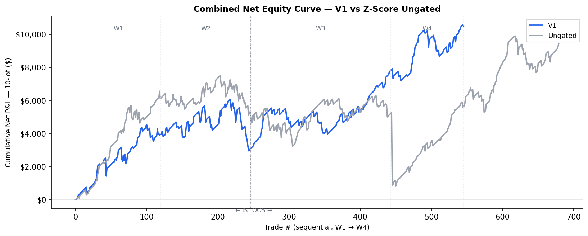
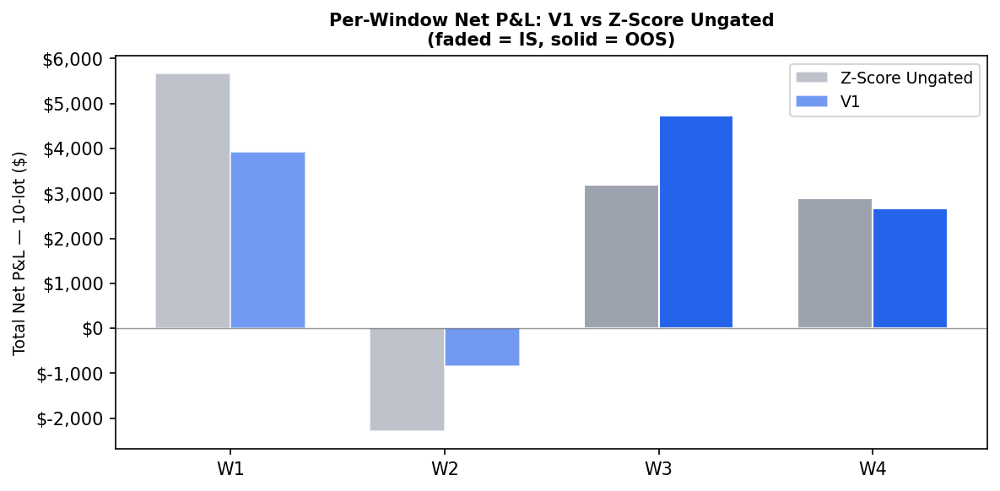
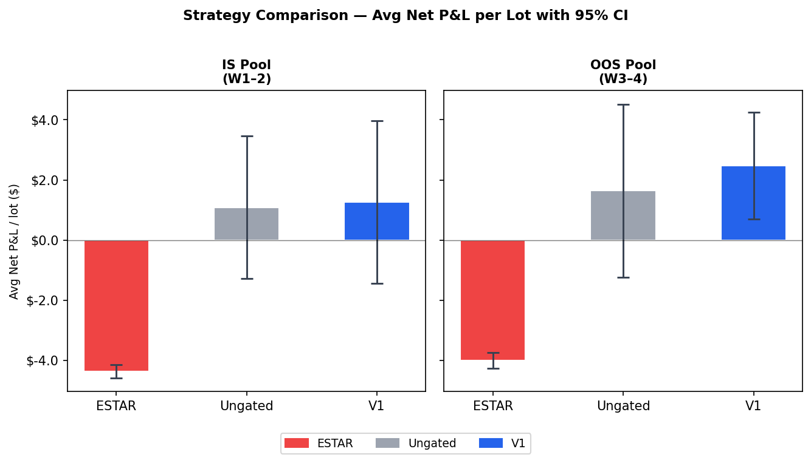

# ES Futures Calendar Spread — Mean-Reversion Research


Quantitative research project studying mean-reversion of the E-mini S&P 500 (ES) calendar spread against its cost-of-carry fair value during quarterly roll windows. Covers four roll periods from September 2024 through June 2025, with full signal development, regime gate engineering, and in-sample / out-of-sample backtest evaluation.

---

## Strategy Overview

**Alpha source:** The observed calendar spread (`ES_back − ES_front`) persistently deviates from its theoretical fair value:

```
FV = S × (r_f − q) × ΔT
```

where `r_f` = SOFR (via FRED), `q` = S&P 500 trailing dividend yield (~1.30%), and `ΔT` = time between expiries from Databento `definition` schema.

**Signal:** Enter when the z-score of `(spread − FV)` crosses ±2.5σ on a 10-minute rolling window (edge-triggered; fill executes at T+1). Exit uses a standard two-layer TP/SL: 90% of position at +0.50 pt (SL moves to breakeven) and 10% at +0.75 pt. Low-z overlay: entries with |entry\_z| < 2.0 at fill time use a single layer at +0.25 pt instead. Position sizing is 10 lots per signal.

**HC add-on:** When |z\_fill| > 3.0 at the T+1 fill bar, an unconditional 10-lot add-on executes at T+2, doubling the position to 20 lots with a blended entry price. The add-on is gated only by the same FOMC exclusion as the primary signal.

**Session decomposition:** Three session types analyzed — European (07:00–12:29 UTC), US RTH (13:30–20:15 UTC), Post-close — with European session identified as the primary alpha source.

**Transaction costs:** $8.04/lot round-trip (exchange fees + NFA + broker); fill model uses synthetic midprice (zero slippage assumption).

---

## Comparison Baselines

### External baseline: Monoyios & Sarno (2002) ESTAR Model

> Monoyios, M. & Sarno, L. (2002). "Mean Reversion in Stock Index Futures Markets: A Nonlinear Analysis." *Journal of Futures Markets*, 22(4), 285–314. DOI: 10.1002/fut.10008

The paper models futures basis nonlinear mean reversion using an ESTAR (Exponential Smooth-Transition Autoregressive) signal:

```
Phi(gamma; z) = 1 − exp(−gamma^2 · z^2)
```

Phi → 0 near equilibrium (unit-root regime); Phi → 1 far from equilibrium (fast mean-reversion). Implemented in [`scripts/ms_baseline.py`](scripts/ms_baseline.py).

**ESTAR baseline results (gamma=0.5, mean-reversion exit at |z|<0.25, SL=0.50pt):**

| Pool | n | avg\_net/lot | p-value | 95% CI | Sharpe |
|------|---|-------------|---------|--------|--------|
| IS  (W1+W2) | 3,000 | −$4.36 | <0.001\*\*\* | [−$4.58, −$4.15] | −0.71 |
| OOS (W3+W4) | 1,782 | −$4.00 | <0.001\*\*\* | [−$4.27, −$3.74] | −0.70 |

The naive ESTAR parameterisation fails on 1-second intraday bars: the mean-reversion exit (`|z| < 0.25`) fires at the first tick-back, producing hold times of ~0 minutes and 4,782 trades across 4 windows. The $8.04/lot TC destroys all gross edge.

### Internal baseline: Z-score Ungated

The same z-score signal with no regime gate (`regime_gate='none'`).

| Pool | n | avg\_net/lot | p-value |
|------|---|-------------|---------|
| IS  aggregate | 554 | +$1.17 | 0.198 |
| OOS aggregate | 670 | +$2.01 | 0.027\*\* |

---

## Key Results — V1 Strategy

### Combined Net Equity Curve — V1 vs Z-Score Ungated (10-lot, W1 → W4)



*V1 (blue) vs Z-Score Ungated (gray). The large W4 drawdown in Ungated is absorbed by V1's drift gate. IS/OOS split at the dashed line.*

### Per-Window Net P&L — V1 vs Z-Score Ungated



*V1 consistently reduces losses in the weaker IS window (W2) and outperforms Ungated in both OOS windows (W3, W4). Faded bars = IS; solid = OOS.*

### Strategy Comparison — Avg Net P&L / Lot with 95% CI



*ESTAR exits at the first tick-back on 1-second bars (hold_med = 0 min), turning all gross edge into TC loss. Ungated and V1 achieve positive per-lot returns; V1 widens the margin in OOS (+$2.47 vs +$1.64/lot).*

V1 adds a `drift_4h` regime gate (block shorts during sustained bullish RTH drift) over the ungated signal.

| Pool | n | Avg Net/Lot | p-value | 90% CI |
|------|---|-------------|---------|--------|
| IS  all (W1+W2) | 554 | +$1.17 | 0.198 | [−$0.61, +$2.94] |
| OOS all (W3+W4) | 670 | +$2.01 | 0.027\*\* | [+$0.24, +$3.79] |
| OOS European | 190 | +$5.15 | <0.001\*\*\* | [+$3.10, +$7.21] |
| OOS V1 gate | 299 | +$2.47 | — | Sharpe CI [+0.06, +0.27] |

**V1 vs Z-score Ungated:**

| Metric | Z-score Ungated | V1 |
|--------|----------|----|
| Net P&L (10-lot) | +$9,452 | +$10,488 |
| Max Drawdown | −$6,659 | −$3,115 |
| Recovery Factor | 1.42 | **3.37** |
| OOS per-trade Sharpe | +0.058 | **+0.159** |
| Annualized Sharpe (OOS) | — | **+3.88** (90% CI: [+1.38, +6.63]) |

**Verdict:** *Marginal positive edge; not yet deployable.* Only the European session achieves statistically significant edge. Evaluation is underpowered (4 roll windows); proper OOS requires ≥10 periods.

**Roll windows:**

| Window | Contracts | Roll Date | Role |
|--------|-----------|-----------|------|
| W1 | ESU4 → ESZ4 | Sep 16, 2024 | In-sample |
| W2 | ESZ4 → ESH5 | Dec 16, 2024 | In-sample |
| W3 | ESH5 → ESM5 | Mar 17, 2025 | Out-of-sample |
| W4 | ESM5 → ESU5 | Jun 16, 2025 | Out-of-sample |

---

## Repository Structure

```
src/
  strategy.py              # Core backtest engine: gate system, simulate(), compute_stats()

scripts/
  ms_baseline.py           # M&S (2002) ESTAR external baseline
  run_sessions.py          # Multi-window, multi-session backtest runner
  run_backtest.py          # Single-window backtest entrypoint
  result_summary.py        # IS/OOS performance report with bootstrap CIs
  databento_cost_estimate.py  # Phase 2a: cost estimation before data pull
  databento_datapull.py    # Phase 2b: tick data pull (idempotent)

notebooks/
  01_eda.ipynb             # W1 exploratory data analysis
  02_signal_analysis.ipynb # Five-signal evaluation (FV z-score, lead-lag, OBI, TFI, FOMC)
  03_zscore_simulation.py  # Z-score parameter sweep
  04_threshold_analysis.py # Entry/exit threshold optimisation
  05_robustness_globex.py  # Globex session robustness check
  07_tearsheet.py          # W1 performance tearsheet
  08_fomc_trend.py         # FOMC event-day analysis
  09-13_...                # Additional window and signal analyses
  results_dashboard.ipynb  # Portfolio equity curves and MDD visualisation

  supplementary/           # 36 publication-quality analysis notebooks
    config.py              # Shared paths and window definitions
    generate_notebooks.py  # Script to regenerate all supplementary notebooks
    A1-A5                  # Performance & equity curves
    B1-B4                  # FV deviation analysis
    C1-C3                  # OU process & z-score dynamics
    D1-D5                  # Trade analytics
    E1-E9                  # Bid-ask spread dynamics
    F1-F4                  # Spike events
    G1-G3                  # Volume migration
    H1-H3                  # Pre-roll context

es_roll_analysis_workflow.md  # Full pipeline design specification
```

> `data/`, `results/`, and `reports/` are gitignored. Tick data lives on external storage (~25–35 GB per roll window for `mbp-10`).

---

## Environment Setup

```bash
# Python 3.14 venv
source .venv/bin/activate
pip install -r requirements.txt
```

Set your Databento API key in the environment:

```bash
export DATABENTO_API_KEY="your_key_here"
```

Data files are expected at `/Volumes/SEAGATE/Databento_Futures/`. Update paths in `notebooks/supplementary/config.py` if your storage location differs.

---

## Running the Analysis

```bash
# Estimate data costs before pulling (review output before proceeding)
python scripts/databento_cost_estimate.py

# Pull tick data (idempotent — skips existing parquet files)
python scripts/databento_datapull.py

# Run M&S ESTAR external baseline
python scripts/ms_baseline.py

# Run full session backtest (Z-score Ungated + V1 gate variants)
python scripts/run_sessions.py

# Generate IS/OOS performance report with bootstrap CIs
python scripts/result_summary.py

# Regenerate all 36 supplementary notebooks
python notebooks/supplementary/generate_notebooks.py
```

---

## Signal Architecture Notes

Five alpha signals were evaluated across W1 and W2:

- **FV Deviation Z-Score** — selected; only signal with consistent positive edge
- **Lead-Lag (front → back)** — rejected; peak cross-correlation at lag=0s (contemporaneous, not predictive)
- **Order Book Imbalance (OBI)** — rejected; r ≈ +0.001 to −0.006 across windows (near-zero)
- **Trade Flow Imbalance (TFI)** — rejected; reverses sign across windows
- **FOMC event-driven jump** — implemented as full-day exclusion filter only

Eight regime gates were evaluated; two were accepted into V1:
1. **drift_4h gate** — blocks short entries during sustained bullish RTH drift (4-hour lookback); saved +$134 IS
2. **low-z two-layer exit** — modified exit for |z| < 2.0 bucket; saved +$58 IS

---

## Disclaimer

This repository contains research code and results for educational and analytical purposes. Nothing here constitutes financial advice or a recommendation to trade. Past backtest performance does not guarantee future results. ES futures carry substantial risk of loss.
